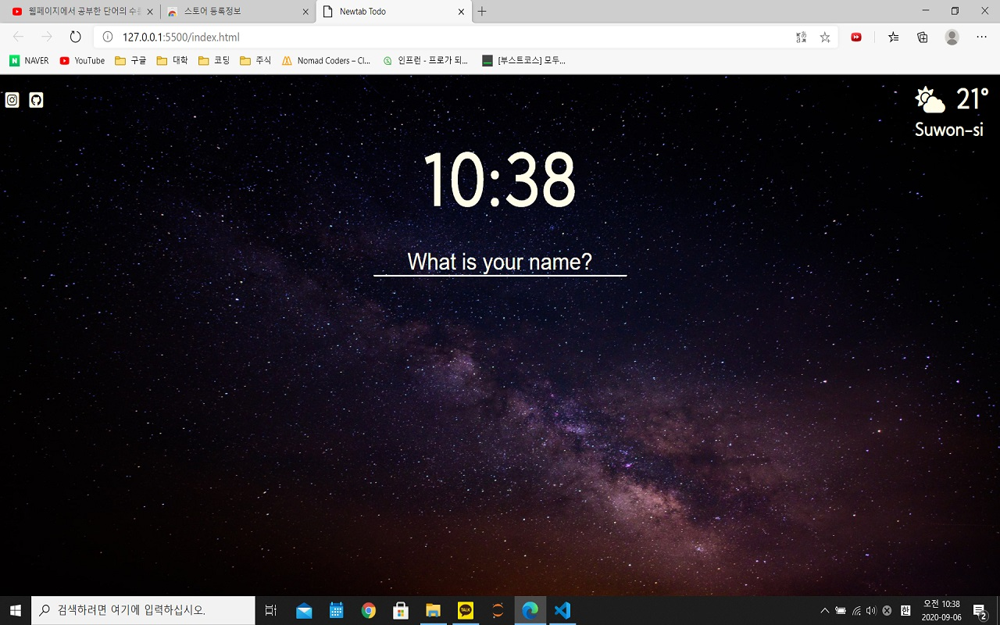
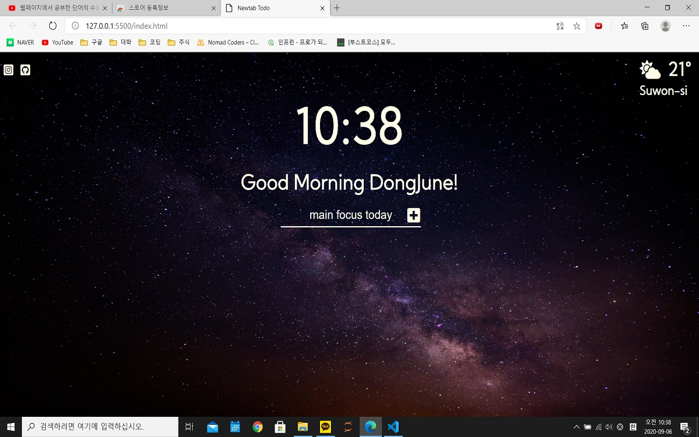
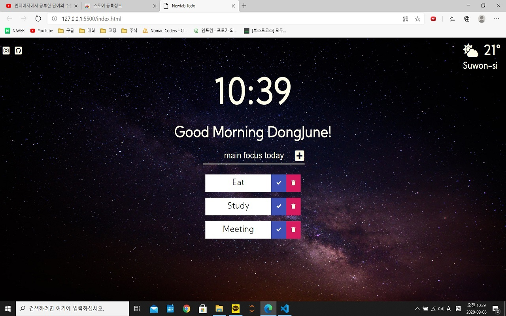
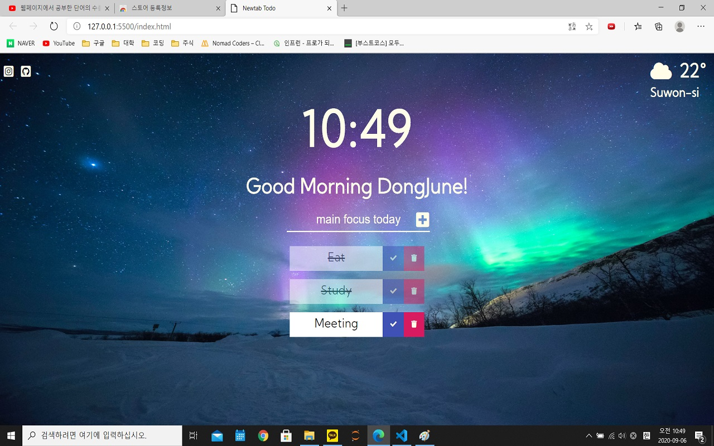
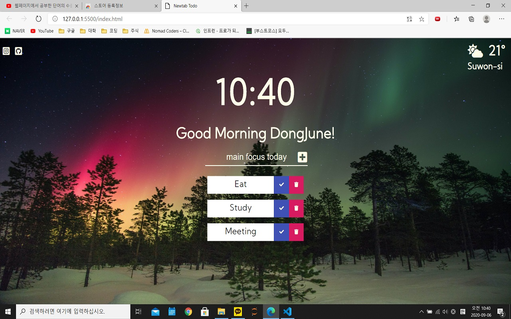

# newTabToDo

## To do list on a new tab at chrome or egde browser.

vanila javascript를 사용하여 개발하였습니다.  
크롬 또는 엣지브라우저에서 새탭을 생성하면 간단한 to do list가 생성되는 chrome extension입니다.

1. **초기 화면**  
   

   초기화면에서는 사용자의 이름을 묻습니다. 사용자의 이름을 입력받아 addEventlistner 함수를 사용하여 localStorage에 저장하도록 했습니다.

```js
form.addEventListener("submit", handleSubmit);
```

2. **이름 입력 후**  
   
   이름을 입력받은 후에는 Date 객체를 사용하여 현재 시간에 따라 다른 인사를 하도록 했습니다.

```js
function getTimeGreeting() {
  const date = new Date();
  const hour = date.getHours();
  if (hour >= 5 && hour < 12) {
    return "Morning";
  } else if (hour >= 12 && hour < 17) {
    return "Afternoon";
  } else {
    return "Evening";
  }
}
```

3. **To Do List 입력**  
   

- form에 할일을 입력하면 to do list에 추가되도록 했습니다.
- 입력을 받으면 createElement 함수를 사용하여 div 안에 text와 체크,쓰레기통 아이콘을 추가하여 html에 생성했습니다.
- 생성된 todo의 text는 localStorage에 저장하여 새로고침 시에도 불러올 수 있도록 했습니다.

4. **check 버튼 클릭**  
   
   to do list의 check 박스를 클릭하면 checked class를 요소에 추가하여 클릭 된 todo의 text에 line through와 투명도를 줬습니다.

5. **trash 버튼 클릭**

- todo list의 쓰레기통 버튼을 클릭하면 클릭된 todo list 가 삭제되고 localStorage에서도 삭제되도록 설정했습니다.
- local storage에서 todo를 삭제할 때는, local storage에서 todo리스트를 불러온 후 클릭 된 todo의 text를 통해 indexOf 함수를 사용하여 선택 한 todo의 index를 찾고 splice를 통해 삭제해줬습니다.

6. **날씨**

- openweathermap 사이트에서 날씨 api를 사용하여 날씨 정보를 json파일로 받아왔습니다.
  https://openweathermap.org/
- 아래의 코드로 사용자의 위치 정보를 받았습니다.

```js
navigator.geolocation.getCurrentPosition(handleGeoSuccess, handleGeoError);
```

- 받아온 json 파일의 정보를 가공하여 html에 추가해줬습니다.

```js
const temperature = json.main.temp;
const jsonPlace = json.name;
const weatherDescription = json.weather[0].description;
const icon = getIconClass(weatherDescription);
weatherIcon.innerHTML = icon;
temp.innerText = `${Math.round(temperature)}°`;
place.innerText = jsonPlace;
```

- 날씨 icon은 json파일의 main과 description 데이터를 getIconClass 함수에 넣어서 main과 description에 따른 아이콘 클래스를 반환하여 설정했습니다. main은 날씨의 대략적인 설명, 예를 들면 Cloud,Rain등의 정보이고 description은 scattered cloud, light rain과 같은 날씨의 구체적인 정보입니다.

```js
else if (main === "Rain") {
    if (description === "light rain" || description === "moderate rain") {
      if (night === 1) {
        return '<i class="fas fa-cloud-moon-rain"></i>';
      } else {
        return '<i class="fas fa-cloud-sun-rain"></i>';
      }
    }
```

7. **배경 이미지**  
   
   
   
   배경 이미지는 총 4개를 사용했습니다. 1~4의 숫자를 랜덤하게 생성하여 이미지가 랜덤으로 보여지도록 설정했습니다.

```js
const randomNum = Math.ceil(Math.random() * IMG_NUM);
paintImage(randomNum);
```

```js
function paintImage(imgNum) {
  const image = new Image();
  image.src = `./image/${imgNum}.jpg`;
  image.classList.add("bgImage");
  body.prepend(image);
}
```
